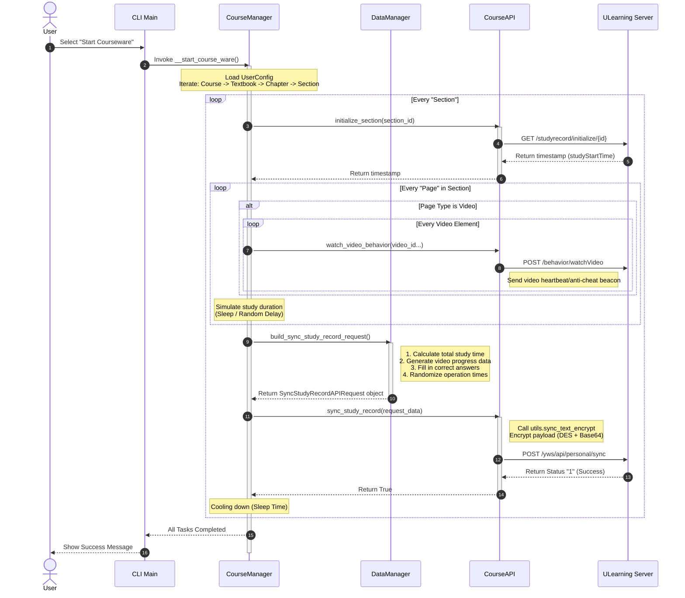

# ULearningCWAuto

## What is ULearningCWAuto?

ULearningCWAuto is an automated CLI tool for completing courseware on the ULearning platform.

## Features

- Video watching with simulated progress
- Question answering with automatic solution lookup
- Document reading simulation
- Content page completion
- Customizable study time
- Multiple users support
- Modify courseware configuration

## Support Sites

- [ULearning](https://www.ulearning.cn)
- [DGUT](https://lms.dgut.edu.cn)

## Usage

- Download the latest release binary from the releases page and run it directly
- Clone the repository and run with Python 3.12+ directly

## How It Works

## Terms and Conditions

By using this tool, you acknowledge that you understand the risks associated with using automation tools on ULearning platforms, and accept the following terms and conditions:

- The author does not guarantee that using this tool will not be detected by the ULearning platform
- Any consequences arising from the use of this tool, including but not limited to disciplinary action, are solely the responsibility of the user
